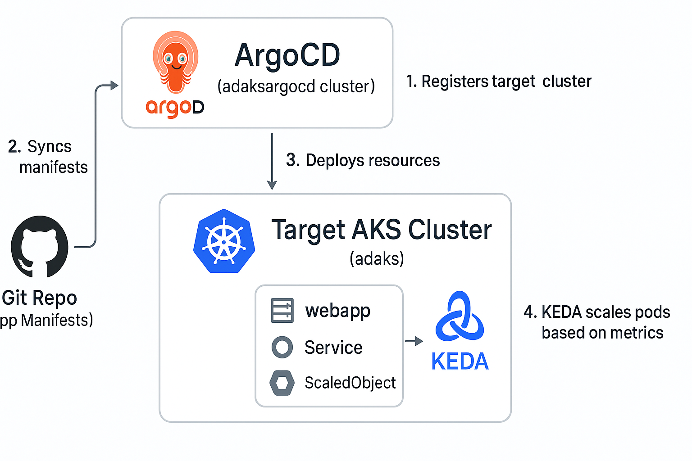

# DevOps Showcase: Multi-Cluster AKS Deployment with ArgoCD, GitHub Actions, and KEDA

This project is a comprehensive demonstration of my DevOps skills, focusing on Infrastructure as Code (IaC), CI/CD automation, multi-cluster Kubernetes management, and GitOps. It leverages Terraform, GitHub Actions, ArgoCD, Azure Kubernetes Service (AKS), and KEDA for autoscaling.

## Technologies Used

- **Terraform** – Provisioning cloud infrastructure (AKS, ACR, VNet, etc.)
- **Azure AKS** – Hosting Kubernetes clusters
- **Azure Container Registry (ACR)** – Storing container images
- **GitHub Actions** – CI/CD and GitOps automation pipelines
- **ArgoCD** – GitOps continuous delivery tool
- **Kubernetes** – Container orchestration
- **KEDA** – Kubernetes Event-driven Autoscaler
- **GitHub Advanced Security** – Code scanning and vulnerability management

---

## Project Structure & Features

### 1. **Infrastructure Provisioning**
- Provisioned 2 AKS clusters (`adaksargocd`, `adaks`) using Terraform
- Created supporting Azure resources: VNet, subnets, ACR, etc.

### 2. **Web Application Deployment**
- Developed a sample web app using [lovable.dev](https://lovable.dev/)
- Dockerized the application
- Pushed the image to ACR via a GitHub Actions pipeline

### 3. **ArgoCD Setup**
- Installed ArgoCD on the `adaksargocd` AKS cluster using a GitHub Actions workflow
- Exposed ArgoCD via LoadBalancer/Ingress

### 4. **Cross-Cluster Configuration**
- Created Kubernetes ServiceAccount, RoleBinding, and Secret in the `adaks` cluster
- Registered `adaks` cluster in ArgoCD (hosted on `adaksargocd`) using GitHub Actions:
  - Applied necessary RBAC manifests
  - Retrieved the server address and token for `adaks`
  - Stored it in a Kubernetes Secret manifest used by ArgoCD

### 5. **GitOps Deployment with ArgoCD**
- Created Kubernetes manifests for:
  - Namespace
  - Deployment
  - Service
  - KEDA ScaledObject
- Defined an ArgoCD Application to sync these manifests to the `adaks` cluster

### 6. **KEDA Integration**
- Installed KEDA on the `adaks` cluster via GitHub Actions
- Used KEDA's ScaledObject to scale the web app based on workload metrics

---

## GitHub Actions Pipelines

- **CI Pipeline:** Builds and pushes Docker image to ACR on code change
- **ArgoCD Deployment:** Installs ArgoCD on AKS
- **Cluster Registration:** Registers `adaks` to ArgoCD from `adaksargocd`
- **Application Sync:** Applies app manifests and triggers ArgoCD sync
- **KEDA Setup:** Installs KEDA into the target cluster

---

## Basic Architecture

---

## Security

- Leveraged **GitHub Advanced Security** for:
  - Code scanning
  - Secret scanning
  - Dependabot alerts

---

## What You Can Learn From This Repo

- Setting up a complete CI/CD pipeline using GitHub Actions
- Multi-cluster Kubernetes management and GitOps using ArgoCD
- Terraform-based Azure infrastructure provisioning
- Autoscaling Kubernetes workloads with KEDA
- Secure development workflows with GitHub Advanced Security

---

## URLs to access the deployed application
- **Web App:** [http://135.235.242.21/](http://135.235.242.21/)
- **ArgoCD UI:** [http://52.140.86.194/](http://52.140.86.194/)
  - Username: `admin`
  - Password: 